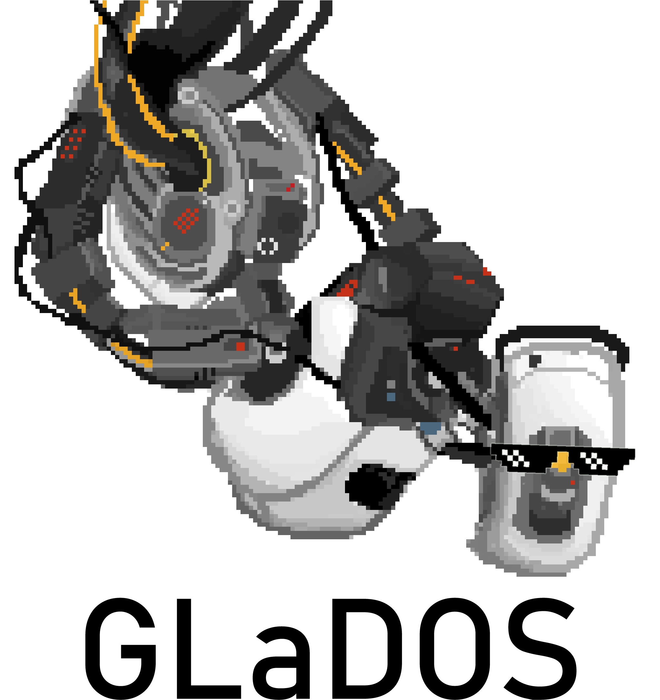

<!--
-->
<!--    
<!--        src="https://emojipedia-us.s3.dualstack.us-west-1.amazonaws.com/thumbs/160/apple/198/robot-face_1f916.png" srcset="https://emojipedia-us.s3.dualstack.us-west-1.amazonaws.com/thumbs/320/apple/198/robot-face_1f916.png 2x" alt="Robot Face on Apple iOS 12.2"-->
<!--        width="120"-->
<!--        height="120">-->
<!--    <h1>Glados</h1>-->
<!--
-->

    

### Glados? O que é isso?

Glados é um projeto de Web bot que será capaz de coletar dados de produtos variados a fim de mensurar a evolução de seu preço, comparando-o também em diferentes sites com o intuito de dar ao publico alvo a chance de pesquisar antes de realizar uma compra.

### Por que Glados?

### O que esse tal Glados faz?

#### Problema

Devido a grande diversidade de sites e descontos, há cada vez mais uma grande dificuldade entre os usuários de encontrar o melhor preço de produtos on-line.

#### Valor agregado

Glados tem como objeto proporcionar uma economia financeira e satisfação pessoal ao usuário, auxiliando-o a realizar a compra do produto almejado pelo melhor preço de maneira mais eficiente. Um segundo objetivo é exibir avaliações de outros usuários sobre o produto para que o cliente se sinta seguro de que está realizando a compra certa.

#### Segmento de mercado

Clientes de e-commerce que visam a econômia e praticidade ao realizar suas compras on-line e clientes que monitoram suas listas de desejos para realizarem a compra no preço mais baixo.

### Integrantes:

:computer: André Luiz Dias Custodio  
:computer: Igor Carvalho  
:computer: Luciano Donizetti  
:computer: Perilo  
:computer: Vinícius  
